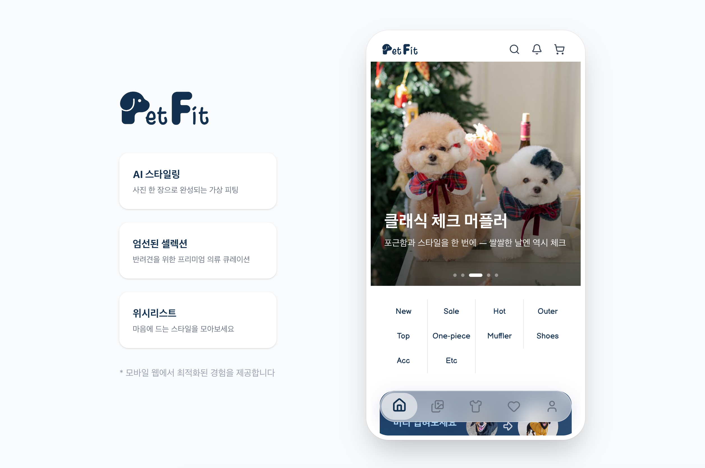

# PetFit

<div align="center">
  
</div>

<div align="center">

[](https://react.dev)
[](https://www.typescriptlang.org)
[](https://vitejs.dev)
[](https://tailwindcss.com)

</div>

---

## 📖 프로젝트 소개

PetFit은 **AI 가상 피팅 기능을 핵심으로 하는 반려견 의류 쇼핑 플랫폼**입니다.

반려견마다 체형이 달라 사이즈 선택이 어렵다는 문제를, AI 합성과 체형 기반 사이즈 추천으로 해결합니다. 구매 전에 내 강아지에게 옷을 미리 입혀보고, 비슷한 체형의 다른 반려인들이 선택한 사이즈를 참고해 더 현명한 쇼핑 결정을 내릴 수 있습니다.

---

## ✨ 주요 기능

### 🤖 AI 스타일링 (핵심 기능)

- 반려견 사진 + 의류 이미지 → Google Gemini AI로 가상 피팅 이미지 생성
- 반려견 체형 데이터(가슴둘레·등길이)를 AI 프롬프트에 자동 주입해 정확도 향상
- 생성 결과 저장 / 갤러리 공유 / 다운로드
  - FREE 플랜: 워터마크 포함, 512px
  - PREMIUM 플랜: 원본 해상도, 워터마크 없음

### 🐾 반려견 프로필 관리

- 반려견 이름, 견종, 나이, 체중, 가슴둘레, 등길이 등록 (최대 5마리)
- **사이즈 추천**: 등록 체형 기반으로 상품별 최적 사이즈와 핏 설명 제공
- **유사 체형 큐레이션**: 가슴둘레 ±20% 범위 사용자들이 많이 구매한 인기 상품 TOP 10

### 🛍️ 이커머스

- 카테고리별 상품 탐색, 키워드 검색, 가격 필터, 정렬
- 장바구니, 찜(위시리스트), 주문, 리뷰 (별점 + 텍스트)

### 📸 갤러리 커뮤니티

- AI 스타일링 결과를 소셜 피드로 공유
- 좋아요 토글, 댓글 작성/삭제, 인기 게시물

### 🔔 알림

- 갤러리 좋아요 / 댓글 / AI 크레딧 경고 / 구독 만료 알림
- 헤더 벨 아이콘에 읽지 않은 알림 수 뱃지 실시간 표시 (30초 폴링)

### 💎 구독 (FREE / PREMIUM)

- FREE: 월 3회 AI 스타일링, 워터마크 포함 다운로드
- PREMIUM: 무제한 AI 스타일링, 원본 해상도 다운로드

---

## 🛠️ 기술 스택

### 프론트엔드

| 기술                  | 버전  | 용도                     |
| --------------------- | ----- | ------------------------ |
| React                 | 19    | UI 프레임워크            |
| TypeScript            | 5.9   | 타입 안전성              |
| Vite                  | 7     | 빌드 도구                |
| Tailwind CSS          | 4     | 스타일링                 |
| Zustand               | 5     | 전역 상태 관리           |
| React Router          | 7     | 클라이언트 사이드 라우팅 |
| Axios                 | 1.13  | HTTP 통신                |
| Framer Motion         | 12    | 애니메이션               |
| React Hook Form + Zod | 7 / 4 | 폼 유효성 검사           |
| Lucide React          | 0.555 | 아이콘                   |

---

## 📱 화면 구성

| 경로             | 페이지                         | 로그인 필요 |
| ---------------- | ------------------------------ | :---------: |
| `/`              | 홈 (배너, 카테고리, 상품 섹션) |      -      |
| `/category/:id`  | 카테고리별 상품 목록           |      -      |
| `/product/:id`   | 상품 상세                      |      -      |
| `/search`        | 검색                           |      -      |
| `/gallery`       | 갤러리 피드                    |      -      |
| `/gallery/:id`   | 갤러리 상세                    |      -      |
| `/ai-styling`    | AI 스타일링                    |      ✓      |
| `/cart`          | 장바구니                       |      ✓      |
| `/checkout`      | 결제                           |      ✓      |
| `/wish`          | 찜 목록                        |      ✓      |
| `/notifications` | 알림                           |      ✓      |
| `/my`            | 마이페이지                     |      ✓      |

### AI 스타일링 플로우

```
반려견 사진 업로드 / 프로필 선택
        ↓
의류 이미지 선택 (상품 목록 or 직접 업로드)
        ↓
AI 합성 요청 (체형 데이터 자동 주입)
        ↓
결과 이미지 확인
        ↓
저장 / 갤러리 공유 / 다운로드
```

---

## 📂 프로젝트 구조

```
src/
├── components/
│   ├── ai/          # AI 스타일링 관련 컴포넌트
│   ├── auth/        # 이메일 인증, 회원가입 폼
│   ├── banner/      # AI 스타일링 홍보 배너
│   ├── cart/        # 장바구니 아이템, 가격 요약
│   ├── common/      # Pagination, ProtectedRoute, ConfirmModal 등
│   ├── gallery/     # 갤러리 피드, 댓글
│   ├── layout/      # Header, Navbar, PageHeader
│   ├── mypage/      # 구독, 주문내역, 반려견 프로필 탭
│   ├── order/       # 결제 모달
│   ├── product/     # ProductCard, ProductGrid, ReviewList 등
│   └── ui/          # Radix UI 기반 공통 컴포넌트
│
├── pages/
│   ├── AIStylingPage.tsx
│   ├── CartPage.tsx
│   ├── CategoryPage.tsx
│   ├── CheckoutPage.tsx
│   ├── GalleryDetailPage.tsx
│   ├── GalleryPage.tsx
│   ├── LoginPage.tsx
│   ├── MyPage.tsx
│   ├── NotificationsPage.tsx
│   ├── ProductDetailPage.tsx
│   ├── SearchPage.tsx
│   ├── SignupPage.tsx
│   └── WishPage.tsx
│
├── services/
│   ├── api.ts              # 전체 re-export 진입점
│   ├── client.ts           # Axios 인스턴스 + JWT 인터셉터
│   ├── authApi.ts
│   ├── productApi.ts
│   ├── cartApi.ts
│   ├── wishlistApi.ts
│   ├── orderApi.ts
│   ├── reviewApi.ts
│   ├── petApi.ts
│   ├── aiApi.ts
│   ├── galleryApi.ts
│   ├── notificationApi.ts
│   ├── subscriptionApi.ts
│   └── fileApi.ts
│
├── store/
│   ├── authStore.ts        # 로그인 상태, 토큰
│   ├── cartStore.ts        # 장바구니 (낙관적 업데이트)
│   └── wishlistStore.ts    # 찜 목록
│
├── hooks/
│   ├── usePagination.ts
│   ├── useProductSort.ts
│   └── useDebounce.ts
│
├── types/                  # TypeScript 타입 정의
├── constants/              # 카테고리 등 상수
├── App.tsx                 # 홈 페이지
└── main.tsx                # 라우팅 진입점
```

---

## 🚀 시작하기

### 사전 요구사항

- Node.js v20.19.6 이상
- npm v10 이상

### 설치 및 실행

1. **저장소 클론**

```bash
git clone https://github.com/P-Project8/PetFit-Front.git
cd PetFit-Front
```

2. **패키지 설치**

```bash
npm install
```

3. **환경 변수 설정**

프로젝트 루트에 `.env` 파일을 생성합니다.

```
VITE_API_BASE_URL=http://YOUR_BACKEND_URL:8080
VITE_GEMINI_API_KEY=YOUR_GEMINI_API_KEY
```

> ⚠️ `.env` 파일은 `.gitignore`에 포함되어 있습니다. 절대 커밋하지 마세요.
> Gemini API 키 발급: https://aistudio.google.com/app/apikey

4. **개발 서버 실행**

```bash
npm run dev
```

브라우저에서 `http://localhost:5173` 접속

### 주요 스크립트

| 명령어            | 설명                 |
| ----------------- | -------------------- |
| `npm run dev`     | 개발 서버 실행       |
| `npm run build`   | 프로덕션 빌드        |
| `npm run preview` | 빌드 결과물 미리보기 |
| `npm run lint`    | ESLint 코드 검사     |

---

## 🎬 시연 영상

<div align="center">
  <a href="https://www.youtube.com/watch?v=IZN_fWjoZuo">
    
  </a>
  <p>클릭하여 시연 영상 보기</p>
</div>

---

## 📚 Wiki

더 자세한 문서는 [Wiki](https://github.com/P-Project8/PetFit-Front/wiki)를 참고하세요.

- [Getting Started](https://github.com/P-Project8/PetFit-Front/wiki/Getting-Started)
- [Tech Stack](https://github.com/P-Project8/PetFit-Front/wiki/Tech-Stack)
- [Frontend Services](https://github.com/P-Project8/PetFit-Front/wiki/Frontend-Services)
