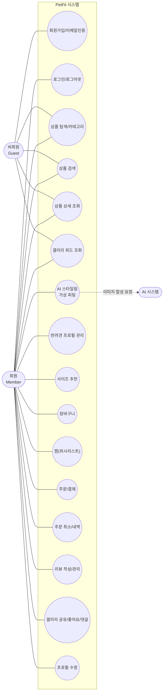
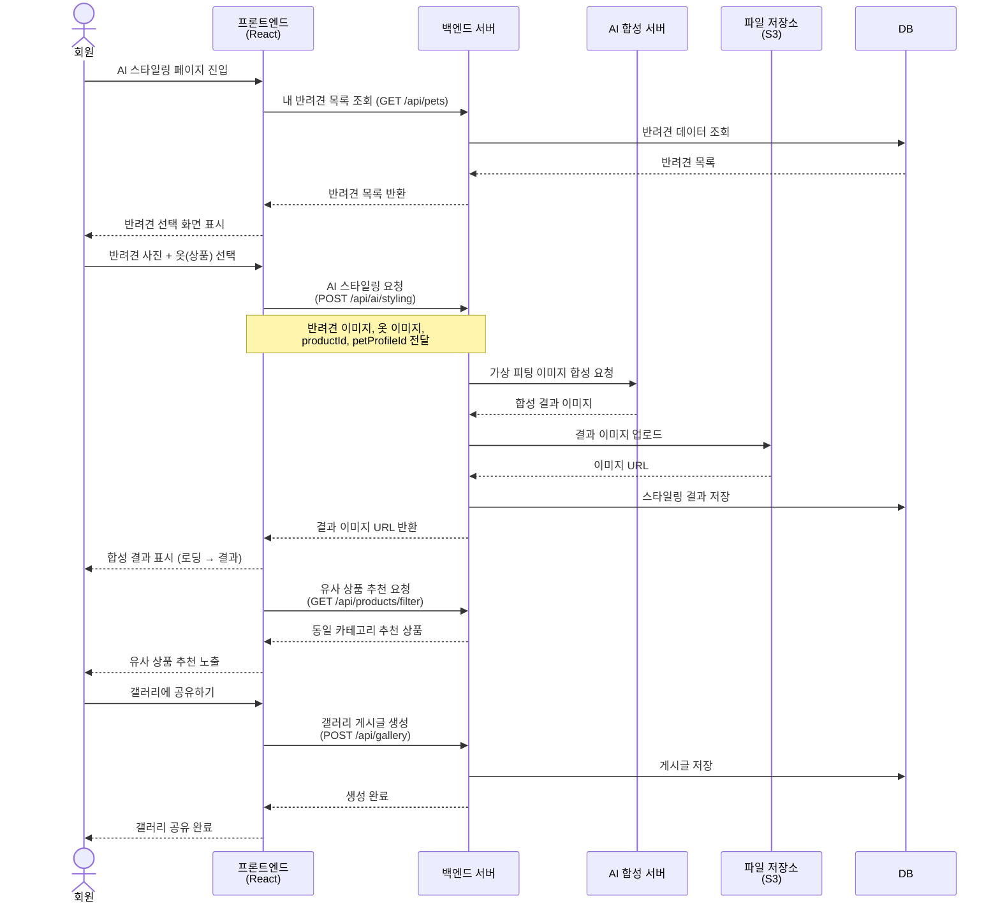
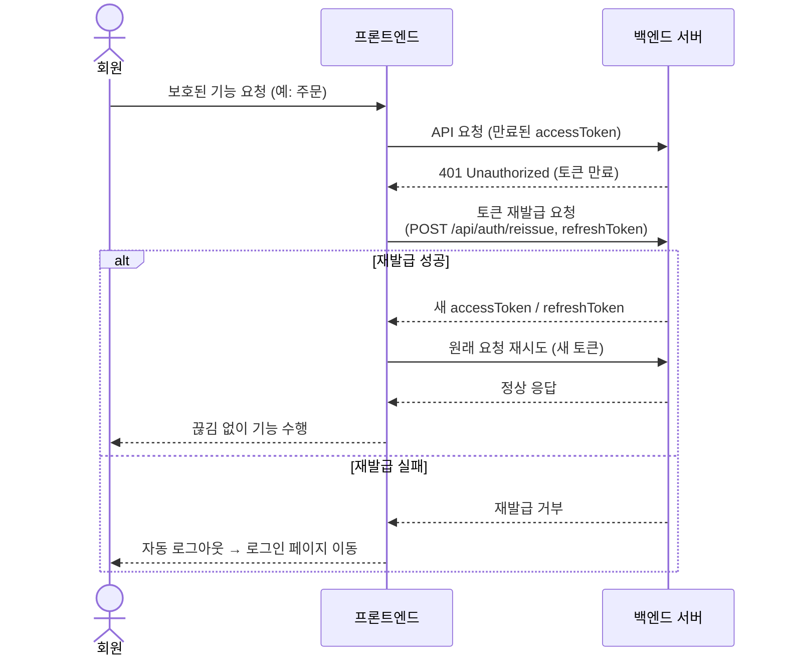

# PetFit 분석 / 설계 산출물

> 최종결과보고서 첨부용
> 1. Use Case Diagram (유스케이스 다이어그램) — 분석 산출물
> 2. Sequence Diagram (시퀀스 다이어그램) — 설계 산출물
> 3. WBS (Work Breakdown Structure) — 프로젝트 관리 산출물

---

## 1. Use Case Diagram (유스케이스 다이어그램)

PetFit 시스템에서 각 액터(사용자)가 수행할 수 있는 기능을 정리한 다이어그램.

### 액터(Actor) 정의

| 액터 | 설명 |
|------|------|
| 비회원(Guest) | 로그인하지 않은 사용자. 상품 탐색·검색·갤러리 조회 등 열람 위주 기능 사용 |
| 회원(Member) | 로그인한 사용자. 구매·AI 스타일링·반려견 관리 등 전체 기능 사용 |
| AI 시스템 | 가상 피팅 이미지를 합성하는 외부 AI 서버 |



> 참고: 회원은 비회원이 할 수 있는 모든 열람 기능(상품 탐색·검색·갤러리 조회 등)을 포함하여 사용 가능.

---

## 2. Sequence Diagram (시퀀스 다이어그램)

핵심 기능인 **AI 스타일링(가상 피팅)** 의 동작 흐름을 시간 순서대로 표현.

### 시나리오: 회원이 반려견에게 옷을 입혀보고 결과를 갤러리에 공유



### (보조) 시나리오: JWT 토큰 자동 재발급



---

## 3. WBS (Work Breakdown Structure)

프로젝트를 기능 단위로 분해한 작업 구조. (담당자·기간은 팀 상황에 맞게 채워 사용)

### 3-1. 트리 구조

```mermaid
flowchart TD
    P[PetFit 프로젝트]

    P --> A[1. 기획/분석]
    P --> B[2. 설계]
    P --> C[3. 프론트엔드 개발]
    P --> D[4. 백엔드 연동]
    P --> E[5. 테스트/마무리]

    A --> A1[1.1 요구사항 정의]
    A --> A2[1.2 기능 명세]
    A --> A3[1.3 화면 설계/와이어프레임]

    B --> B1[2.1 UI/UX 디자인]
    B --> B2[2.2 DB/API 설계]
    B --> B3[2.3 컴포넌트 구조 설계]

    C --> C1[3.1 공통/레이아웃]
    C --> C2[3.2 회원/인증]
    C --> C3[3.3 상품/쇼핑]
    C --> C4[3.4 AI 스타일링]
    C --> C5[3.5 반려견 프로필]
    C --> C6[3.6 갤러리]
    C --> C7[3.7 마이페이지]

    D --> D1[4.1 인증/토큰 연동]
    D --> D2[4.2 상품/주문 API]
    D --> D3[4.3 AI 스타일링 API]
    D --> D4[4.4 갤러리/리뷰 API]

    E --> E1[5.1 통합 테스트]
    E --> E2[5.2 버그 수정]
    E --> E3[5.3 발표/보고서]
```



### 3-2. 작업 분해 표

| 대분류 | 중분류 | 세부 작업 | 담당 | 기간 |
|--------|--------|-----------|:---:|:---:|
| 1. 기획/분석 | 1.1 요구사항 정의 | 서비스 목표·핵심 기능 도출 | | |
| | 1.2 기능 명세 | 기능 목록·유스케이스 정리 | | |
| | 1.3 화면 설계 | 와이어프레임·화면 흐름 정의 | | |
| 2. 설계 | 2.1 UI/UX 디자인 | 컬러·레이아웃·모바일 우선 설계 | | |
| | 2.2 DB/API 설계 | 엔티티·API 명세 정의 | | |
| | 2.3 컴포넌트 설계 | 재사용 컴포넌트 구조 설계 | | |
| 3. 프론트엔드 | 3.1 공통/레이아웃 | 헤더·네비·라우팅·보호 라우트 | | |
| | 3.2 회원/인증 | 회원가입·이메일인증·로그인·토큰 | | |
| | 3.3 상품/쇼핑 | 목록·검색·필터·상세·장바구니·찜·결제·리뷰 | | |
| | 3.4 AI 스타일링 | 업로드·합성·결과·유사상품 추천 | | |
| | 3.5 반려견 프로필 | 등록·관리·사이즈 추천·체형 큐레이션 | | |
| | 3.6 갤러리 | 피드·공유·좋아요·댓글 | | |
| | 3.7 마이페이지 | 프로필·주문내역·내 스타일링 | | |
| 4. 백엔드 연동 | 4.1 인증 | JWT·토큰 자동 재발급 연동 | | |
| | 4.2 상품/주문 | 상품·장바구니·주문 API 연동 | | |
| | 4.3 AI 스타일링 | 가상 피팅 API 연동 | | |
| | 4.4 갤러리/리뷰 | 갤러리·리뷰 API 연동 | | |
| 5. 테스트/마무리 | 5.1 통합 테스트 | 기능별 통합 점검 | | |
| | 5.2 버그 수정 | 이슈 수정·안정화 | | |
| | 5.3 발표/보고서 | 결과보고서·발표자료 작성 | | |

---

## 부록: Mermaid 다이어그램 사용 방법

- 위 ```mermaid 코드 블록은 **GitHub, Notion, VS Code(Markdown Preview Mermaid 확장), Typora** 등에서 자동으로 그림으로 렌더링됨
- Word/PPT에 이미지로 넣으려면:
  1. [https://mermaid.live](https://mermaid.live) 접속
  2. 위 코드 블록 내용 붙여넣기
  3. 우측 상단 `Actions → PNG/SVG` 다운로드 후 문서에 삽입
